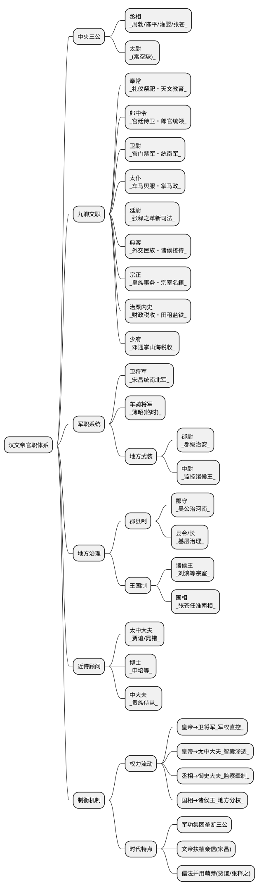

```plantuml
@startmindmap

* 汉文帝官职体系
** 中央三公
*** 丞相\n_周勃/陈平/灌婴/张苍_
'统百官・决国政
*** 太尉\n_(常空缺)_
'::::战时周勃/灌婴
'*** 御史大夫\n_张苍/冯敬_
'::::监察副相・掌文书

** 九卿文职
*** 奉常\n_礼仪祭祀・天文教育_
*** 郎中令\n_宫廷侍卫・郎官统领_
*** 卫尉\n_宫门禁军・统南军_
*** 太仆\n_车马舆服・掌马政_
*** 廷尉\n_张释之革新司法_
*** 典客\n_外交民族・诸侯接待_
*** 宗正\n_皇族事务・宗室名籍_
*** 治粟内史\n_财政税收・田租盐铁_
*** 少府\n_邓通掌山海税收_

** 军职系统
*** 卫将军\n_宋昌统南北军_
'::::京城禁卫・文帝亲掌
*** 车骑将军\n_薄昭(临时)_
'::::征伐后即罢
*** 地方武装
**** 郡尉\n_郡级治安_
**** 中尉\n_监控诸侯王_

** 地方治理
*** 郡县制
**** 郡守\n_吴公治河南_
'::::民政司法・中央直任
**** 县令/长\n_基层治理_
*** 王国制
**** 诸侯王\n_刘濞等宗室_
'::::有限民政权
**** 国相\n_张苍任淮南相_
'::::中央委派・实控政务

** 近侍顾问
*** 太中大夫\n_贾谊/晁错_
'::::政策顾问
*** 博士\n_申培等_
'::::学术参政
*** 中大夫\n_贵族侍从_
'::::后备梯队

** 制衡机制
*** 权力流动
**** 皇帝→卫将军_军权直控_
**** 皇帝→太中大夫_智囊渗透_
**** 丞相→御史大夫_监察牵制_
**** 国相→诸侯王_地方分权_
*** 时代特点
**** 军功集团垄断三公
**** 文帝扶植亲信(宋昌)
**** 儒法并用萌芽(贾谊/张释之)
@endmindmap
```